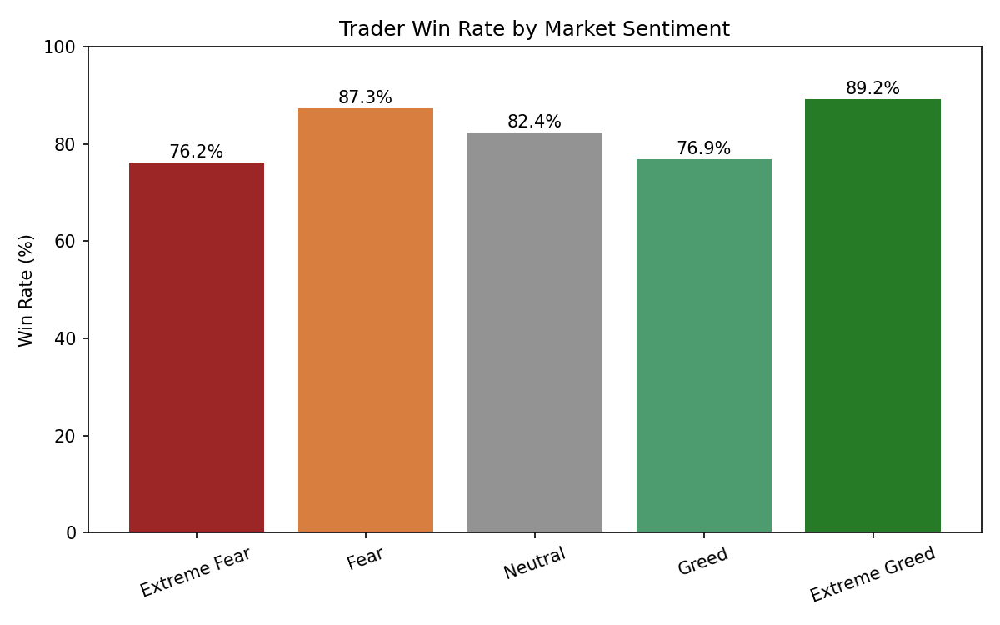
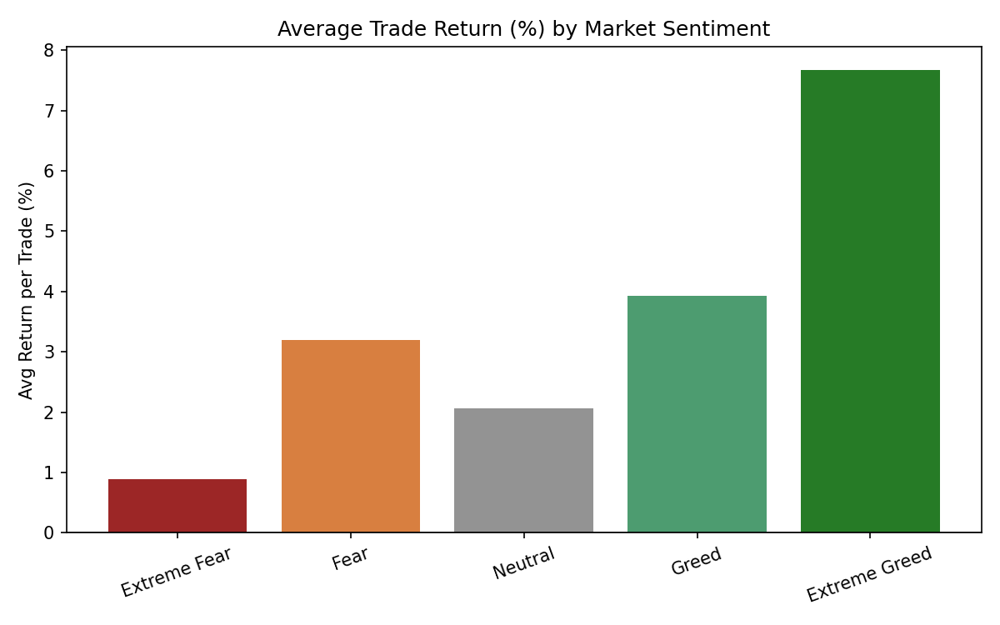
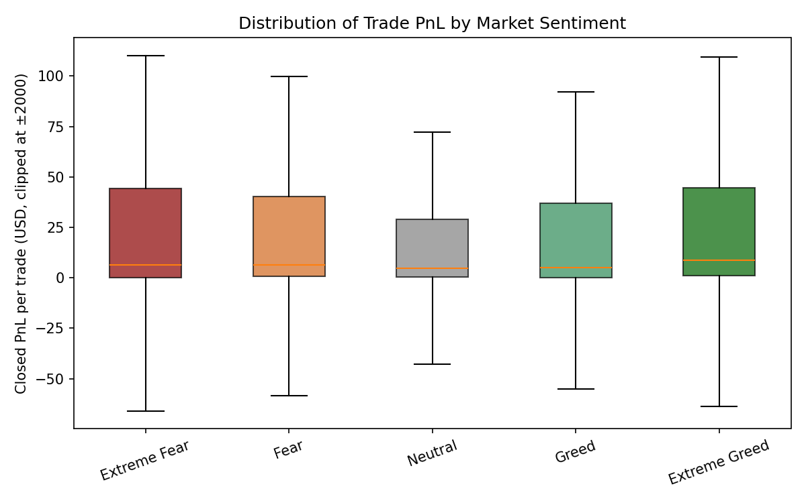
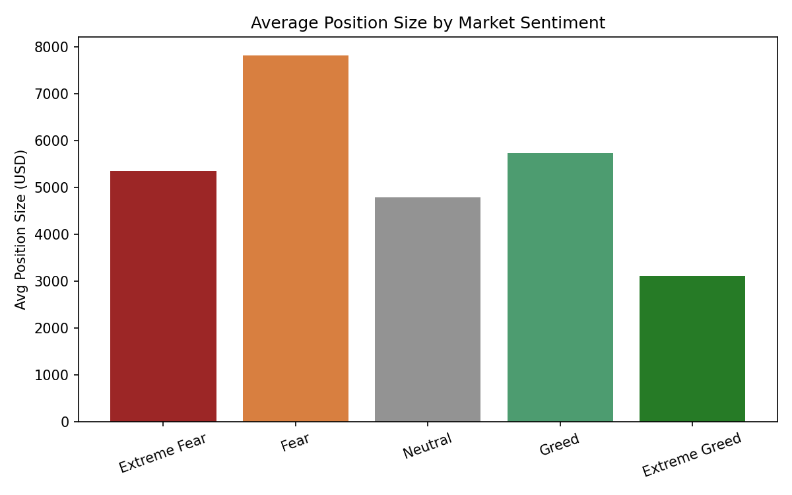
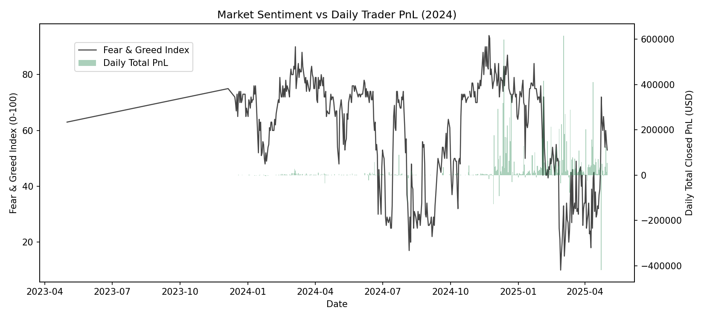

# Bitcoin Sentiment & Trader Performance Analysis

Does Bitcoin market sentiment (Fear & Greed Index) actually relate to how traders perform? This project merges historical Hyperliquid trade data with the Fear & Greed Index and tests whether performance differs meaningfully across sentiment regimes.

## Key Finding

Trader performance was **strongest during Extreme Greed** (89.2% win rate, 7.67% avg return per trade) and **weakest during Extreme Fear** (76.2% win rate, 0.89% avg return per trade). This difference was tested with a Kruskal-Wallis test and is statistically significant (H = 730.33, p < 0.0001), meaning it's very unlikely to be due to chance.

Interestingly, average position size did **not** follow the same pattern — traders took their largest positions during **Fear** ($7,816 avg) and smallest during **Extreme Greed** ($3,112 avg), suggesting traders size down rather than "get greedy" when sentiment is euphoric.

## Charts

**Win Rate by Sentiment**


**Average Return per Trade**


**PnL Distribution**


**Position Size by Sentiment**


**Sentiment vs Daily PnL Over Time**


## Data Sources

- **Bitcoin Fear & Greed Index** — `fear_greed_index.csv`, sourced from [Alternative.me Crypto Fear & Greed Index](https://alternative.me/crypto/fear-and-greed-index/)
- **Hyperliquid trade history** — `historical_data.csv`, historical trade-level data exported from Hyperliquid covering account-level trades (timestamp, size, side, direction, PnL)

Both files are provided as `dataset.zip` (raw CSVs were too large to upload individually to GitHub's web UI).

## Repo Contents

| File | Description |
|---|---|
| `analysis.py` | Loads and cleans both datasets, merges trades with sentiment by date, computes daily and trade-level performance stats, runs the Kruskal-Wallis significance test |
| `charts.py` | Generates all 5 charts from the merged data |
| `bitcoinassignment.ipynb` | Notebook version showing the full run output |
| `dataset.zip` | Raw source data (Fear & Greed Index + Hyperliquid trade history) |
| `trade_stats.csv`, `daily_stats.csv` | Output summary tables by sentiment class |
| `chart1`–`chart5_*.png` | Generated chart images |
| `Bitcoin_Sentiment_Trader_Analysis.docx` | Full written report with methodology, findings, and conclusions |

## Methodology

1. Cleaned and date-aligned both datasets
2. Merged trades with same-day sentiment classification (Extreme Fear → Extreme Greed)
3. Computed both **account-level daily** stats and **individual closed-trade** stats
4. Tested for statistically significant performance differences across sentiment categories using a Kruskal-Wallis H-test (non-parametric, appropriate since PnL isn't normally distributed)
5. Checked position-sizing and buy/sell bias by sentiment as secondary signals

## How to Run

```bash
pip install pandas numpy matplotlib scipy
```

1. Unzip `dataset.zip` into the project folder
2. Update the file paths in `analysis.py` to point to the unzipped CSVs
3. Run:

```bash
python analysis.py
python charts.py
```

This regenerates `merged.csv`, `trade_stats.csv`, `daily_stats.csv`, and all 5 charts.

## Tools Used
Python, pandas, NumPy, Matplotlib, SciPy (Kruskal-Wallis test)
